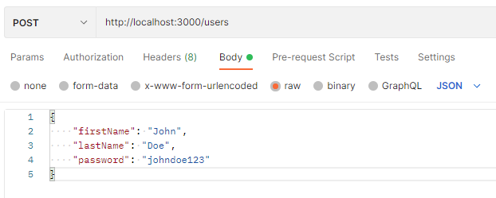
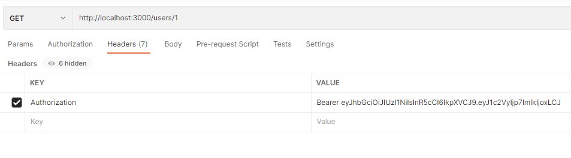

# Storefront Backend API

## Getting Started

This repo contains a simple storefront backend RESTful API which has endpoints for products, users and orders.  
For requirements, database schema data shapes and endpoints mapping: refer to [REQUIREMENTS](REQUIREMENTS.md)

## Used Technologies
This application uses the following libraries:
- Postgres for the database
- Node/Express for the application logic
- dotenv from npm for managing environment variables
- db-migrate from npm for migrations
- bcrypt from npm for encrypting users passwords
- jsonwebtoken from npm for working with JWTs
- jasmine from npm for testing

## How to setup

### 1. Get a local copy of this repo
### 2. Install all application dependencies
- "bcrypt": "^4.0.0",
- "body-parser": "^1.19.0",
- "cors": "^2.8.5",
- "db-migrate": "^0.11.12",
- "db-migrate-pg": "^1.2.2",
- "dotenv": "^8.2.0",
- "express": "^4.17.1",
- "jsonwebtoken": "^8.5.1",
- "node": "^12.22.12",
- "pg": "^8.5.1"

**Note**: I have faced a lot of compatibility issues between Node and Postgres. So I recommend using the very specific packages versions mentioned above, otherwise the application is not guaranteed to work.
### 3. Create psql production database called *store* and another one for testing called *store_test*
### 4. Add `.env` file that should look like the following:
```
POSTGRES_USER=your_psql_user  
POSTGRES_HOST=localhost  
POSTGRES_DB=store  
POSTGRES_TEST_DB=store_test  
POSTGRES_PASSWORD=your_psql_password  
POSTGRES_PORT=5432  
BCRYPT_PASSWORD=password123  
SALT_ROUNDS=10  
TOKEN_SECRET=token123  
ENV=production  
```
### 5. Modify `database.json` to contain your psql username and password
### 6. Backend runs on port: 3000, Database runs on port: 5432


## How to run
After you setup the project correctly, open the project directory in terminal and simply enter `npm run start`  
this script will take care of compiling typescript files, migrate database tables, and running compiled javascript server

## How to run jasmine test suites
Open the project directory in terminal and simply enter `npm run test`  
this script will take care of compiling typescript files, changing environment variable ENV in `.env` file to *test*, migrate database tables, and running jasmine test suites

## How to test the API endpoints
I used Postman to test the endpoints as follows:

### Users endpoints
### 1. create a user
This requires a json object  
use POST method with `http://localhost:3000/users` endpoint to create a user  
provide new user information as a JSON object in the *body*  

  

this will return a jwt that you can use for authorization  

  

**Note**: you can visit [jwt.io](https://jwt.io/#debugger-io) to verify the jwt  

### 2. index all users
This requires authorization  
use GET method with `http://localhost:3000/users` endpoint to index all users  
add `Authorization` KEY to *Headers* with VALUE = '`Bearer <jwt>`' where jwt is a token returned by creating a user in step 1

  

this will return an array of all users in database  

### 3. show one user
This requires authorization  
use GET method with `http://localhost:3000/users/:id` endpoint to show a user with id provided  
add `Authorization` KEY to *Headers* with VALUE = '`Bearer <jwt>`' where jwt is a token returned by creating a user in step 1

  

this will return a json object of the user in database  


### Products endpoints
### 1. create a product
This requires a json object and authorization   
use POST method with `http://localhost:3000/products` endpoint to create a product  
provide new product information as a JSON object in the *body*  
add `Authorization` KEY to *Headers* with VALUE = '`Bearer <jwt>`' where jwt is a token returned by creating a user  

  

this will return the created product from database   

### 2. index all products
This requires nothing  
use GET method with `http://localhost:3000/products` endpoint to index all products  

  

this will return an array of all products in database  

### 3. show one product
This requires nothing   
use GET method with `http://localhost:3000/products/:id` endpoint to show a product with id provided  

  

this will return a json object of the product in database  

### Orders endpoints
### 1. index current/active orders for a user
This requires authorization   
use GET method with `http://localhost:3000/users/:id/orders/active` endpoint to index all active orders for user with id provided  
add `Authorization` KEY to *Headers* with VALUE = '`Bearer <jwt>`' where jwt is a token returned by creating a user  

  

this will return the current orders for the user from database (always an empty array as creating orders is not currently supported in this version)  
