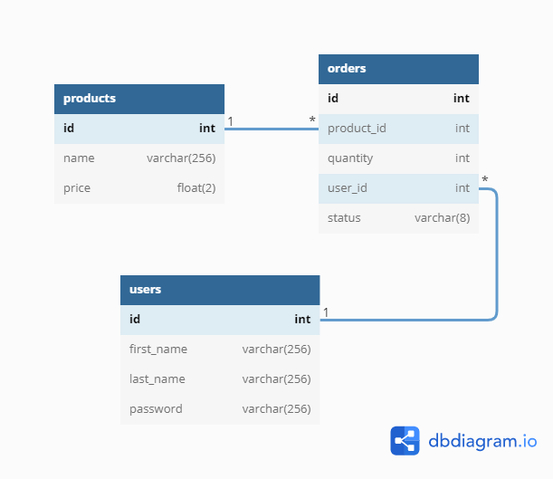

## API Requirements
The company stakeholders want to create an online storefront to showcase their great product ideas. Users need to be able to browse an index of all products, see the specifics of a single product, and add products to an order that they can view in a cart page. You have been tasked with building the API that will support this application, and your coworker is building the frontend.

These are the notes from a meeting with the frontend developer that describe what endpoints the API needs to supply, as well as data shapes the frontend and backend have agreed meet the requirements of the application. 

## API Endpoints
### Products
- Index: `'products/' [GET]`
- Show: `'products/:id' [GET]`
- Create (args: Product) [token required]: `'products/' [POST]`

### Users
- Index [token required]: `'users/' [GET]`
- Show [token required]: `'users/:id' [GET]`
- Create (args: User) [token required]: `'users/' [POST]`

### Orders
- Current Orders by user [token required]: `'/users/:id/orders/active' [GET]`


## Database schema


## Data Shapes
### Products
- id
- name
- price

```
create table products (
    id serial primary key,
    name varchar(256) not null,
    price float(2) not null
);
```
### Users
- id
- first name
- last name
- password

```
create table users (
    id serial primary key,
    first_name varchar(256) not null,
    last_name varchar(256) not null,
    password varchar(256) not null
);
```
### Orders
- id
- id of the product
- quantity of the product
- id of the user
- status of order (active or complete)

```
create table orders (
    id serial primary key,
    product_id int not null,
    quantity int not null,
    user_id int not null,
    status varchar(8) not null,
    foreign key(product_id) references products(id),
    foreign key(user_id) references users(id)
);
```